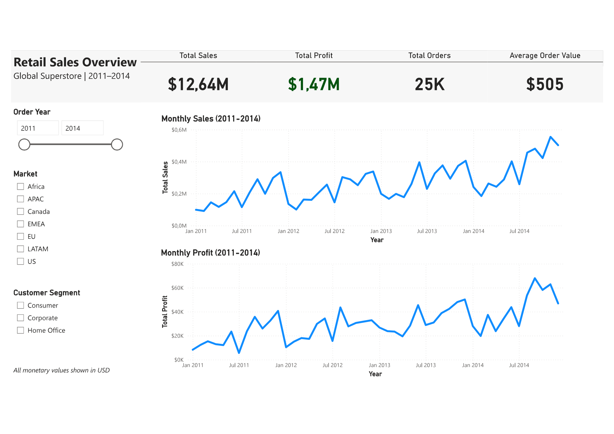
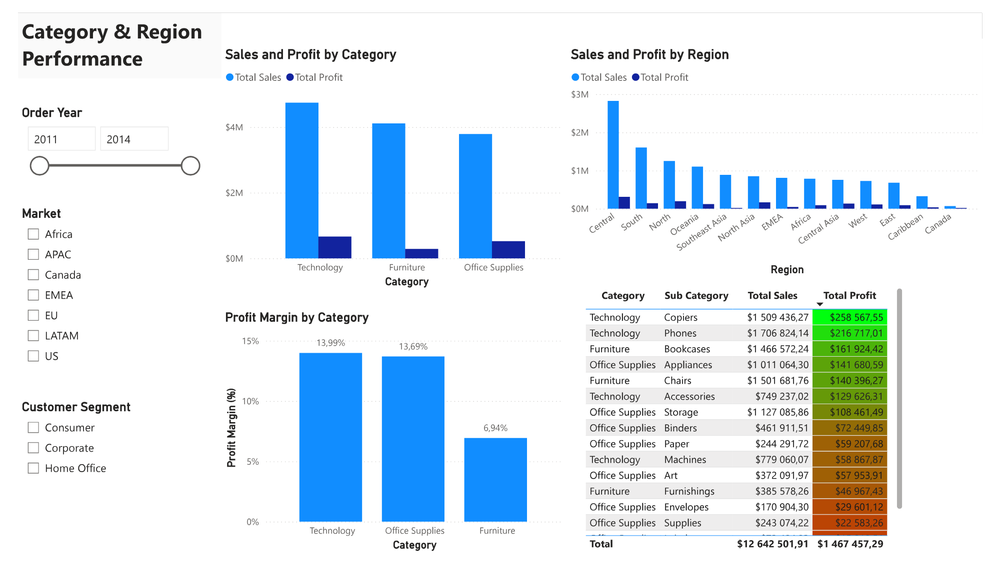
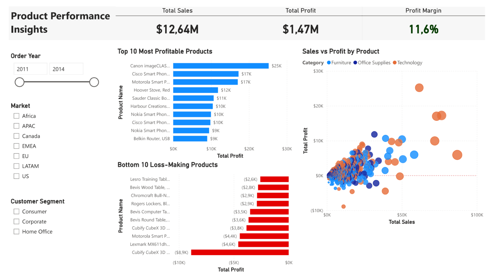
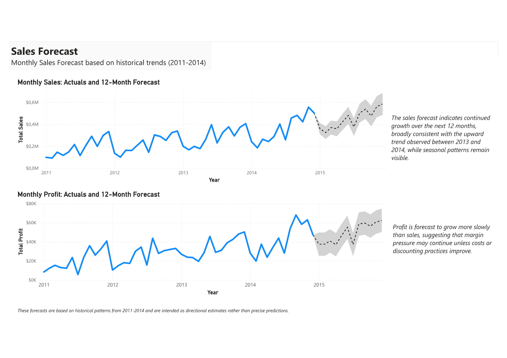
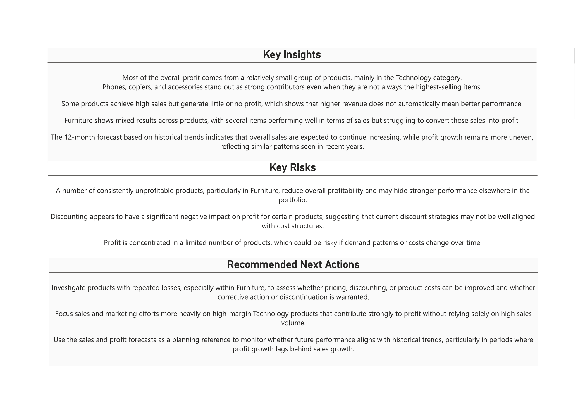

# Retail Sales Insights and Forecasting

End to end retail sales analysis and forecasting using **R** for data preparation and modeling, and **Power BI** for interactive dashboards and insights.

This project focuses on taking raw retail transaction data, turning it into a clean analytical dataset, building clear KPIs, exploring what drives sales and profit, and producing simple, realistic forecasts based on historical trends.

---

## Project Overview

I built this project to apply what I learned after completing the **Microsoft Power BI Data Analyst Professional Certificate (Coursera)**, and to combine those skills with my background in **R** and data analysis.

Starting from a raw global retail dataset, I cleaned and transformed the data in **R**, created **Power BI** ready tables, and designed a multi page dashboard that highlights performance over time, differences across categories and regions, product level behaviour, and future outlook.

The final result is an interactive **Power BI** dashboard supported by a reproducible data preparation pipeline.

---

## Dataset

- **Dataset**: Global Superstore Dataset  
- **Source**: Kaggle  
- **Time Period**: 2011 to 2014  
- **Scope**: Global retail transactions across multiple markets, regions, product categories, and customer segments  

Key fields include:
- Order dates and order identifiers  
- Sales, profit, quantity, discounts, and shipping costs  
- Product, category, and sub category information  
- Geographic attributes such as market, region, and country  

The dataset works well for both descriptive analysis and time series based forecasting.

---

## Why I Did This Project

I built this project to:

- Practice structuring a full analytics project from raw data to final dashboard  
- Strengthen my skills in **R** for data cleaning and feature engineering  
- Apply **Power BI** for data modeling, DAX calculations, and dashboard design  
- Include forecasting rather than only historical analysis  
- Build a project that reflects practical analytics work  

A big focus throughout the project was on **clear data visualization**. The goal was not to add complexity, but to present information in a way that is easy to understand and useful for decision making.

---

## Project Workflow

The project followed a clear and structured process:

1. Loaded the raw Global Superstore dataset into R  
2. Cleaned and standardized column names and data types  
3. Parsed and engineered date features such as year, month, and year month  
4. Created clean, analysis ready tables for Power BI 
5. Saved processed datasets to a structured `data/processed` folder  
6. Designed a fact table focused on sales transactions  
7. Imported processed data into Power BI  
8. Built relationships and validated the data model  
9. Created core KPIs such as total sales, total profit, total orders, and average order value  
10. Developed DAX measures including profit margin  
11. Designed multi page dashboards with consistent layout and filtering  
12. Analysed category, region, and product level performance  
13. Applied Power BI forecasting to monthly sales and profit  
14. Interpreted forecast results carefully and realistically  
15. Summarised key insights, risks, and next steps in an executive style page  

All data preparation steps are fully reproducible using the R scripts in this repository.

---

## Power BI Dashboard Overview

The Power BI dashboard consists of five focused pages, each answering a specific set of questions.

### 1. Retail Sales Overview

High level KPIs and time series trends showing overall sales, profit, order volume, and growth over time. Interactive slicers allow filtering by year, market, and customer segment.

---

### 2. Category and Region Performance

Breakdown of sales and profit by product category and geographic region. This page highlights clear performance differences across markets and categories.

---

### 3. Product Performance Insights

A closer look at product and sub category performance, showing which products drive revenue versus profit and where margin pressure exists.

---

### 4. Sales and Profit Forecast

Twelve month forecasts for monthly sales and profit based on historical patterns from 2011 to 2014. The forecasts are intended as directional guidance rather than exact predictions.

---

### 5. Executive Summary and Recommendations

A concise summary of key insights, risks, and suggested next actions, written for a non technical audience.

---

## Forecasting Approach

Forecasts were created using Power BI’s built in time series forecasting on monthly aggregated data.

*Key observations:*

- Sales are expected to continue following the existing upward trend
- Profit growth appears slower than sales growth
- Seasonal patterns remain visible in the forecast
- Confidence intervals are included to reflect uncertainty

The forecasts are positioned as support for planning rather than precise predictions.

---

## Tools and Technologies Used

### Data Preparation and Analysis
- **R**
- **tidyverse**

### Business Intelligence and Visualization
- **Power BI**
- **Power Query** for data transformation
- **DAX** for calculated measures and KPIs

### Practical Skills Used
- Data cleaning and transformation  
- Data modeling and relationships  
- KPI design and validation  
- Time series analysis and forecasting 
- Data visualization and dashboard design
- Communicating insights clearly

---

## Repository Structure

- **data/processed/**  
  Cleaned and transformed datasets prepared in R and used directly in Power BI.

- **scripts/**  
  R scripts used for data cleaning, feature engineering, and preparing Power BI ready tables.

- **powerbi/screenshots/**  
  Screenshots of each Power BI dashboard page.

- **Retail-Sales-Insights-and-Forecasting.pbix**  
  Power BI dashboard file.
  
- **README.md**  
  Project documentation.

- **.gitignore**  
  Git configuration file.

The full interactive dashboard can be explored locally by opening the Power BI file.

---

## Final Notes

This project focuses on clarity and solid fundamentals rather than visual overload. The dashboard is designed to be easy to read, interactive, and useful for exploring the data.

---

## Contact

If you would like to connect or give feedback on this project (much appreciated):

- LinkedIn: https://www.linkedin.com/in/joshua-kohlmeyer/  
- GitHub: https://github.com/JoshuaKohlmeyer

##
